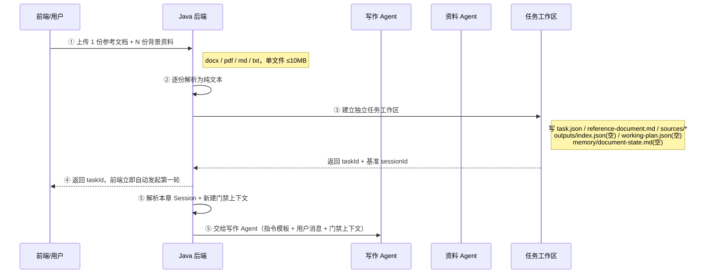
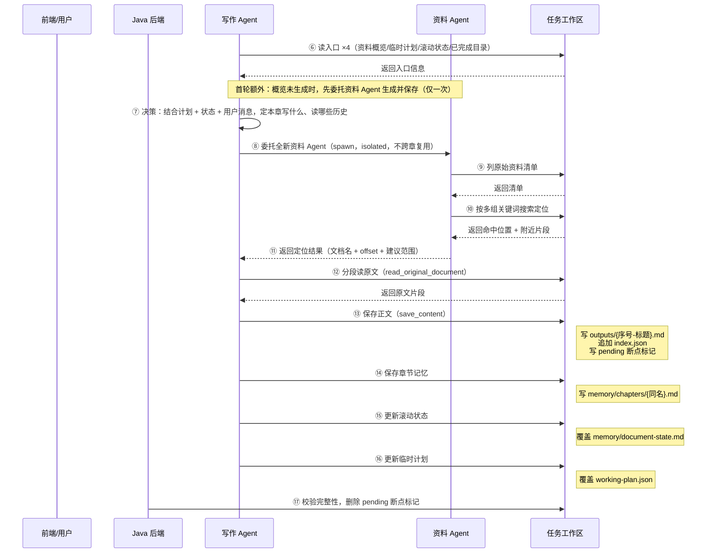
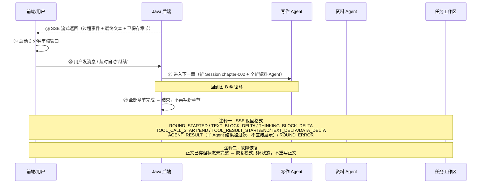

# 增量写作 Agent 全流程详解

> 本文用三张同泳道时序图 + 八个问题，完整讲解写作任务从「用户上传资料创建任务」到「多章循环完成」的完整流程：五个参与者如何协作、上传文档与 memory 怎么处理、临时计划怎么做、每个文件的作用、消息与返回信息的格式。全部内容已对照源码与真实运行数据（task-9ca29d69 任务目录）逐条核实。

**结论先行**：整个系统是「1 个写作 Agent（父）+ 每章临时拉起的资料 Agent（子）+ 1 个任务工作区（文件系统，作为共享记忆）」三方协作。Java 只提供工具与目录，每章写什么、查什么、读哪些历史，全部由写作 Agent 自主决定，没有硬编码的业务动作枚举。

---

## 一、总览：三张同泳道时序图

完整流程按阶段拆为三张同泳道时序图，步骤编号 ①-㉒ 全书连续、首尾衔接：

- **图 A「上传与工作区建立」**（①-⑤）
- **图 B「章内工作流」**（⑥-⑰，每轮重复的核心循环）
- **图 C「审核循环与返回」**（⑱-㉒，含故障恢复与 SSE 返回格式两个注释区）

每张图均为 5 条泳道：前端/用户、Java 后端、写作 Agent、资料 Agent、任务工作区。

### 图 A：上传与工作区建立（①-⑤）



### 图 B：章内工作流（⑥-⑰，每轮重复）



### 图 C：审核循环与返回（⑱-㉒）



---

## 二、五阶段走读

### ① 创建任务（步骤 1-3）

前端上传 1 份参考文档 + 多份背景资料（docx/pdf/md/txt，≤10MB）→ 后端逐份解析出纯文本 → 建立独立任务工作区：`reference-document.md`（参考文档）、`sources/`（事实资料）、`outputs/`（成果）、`memory/`（两层记忆）、`working-plan.json`（临时计划）、`outputs/index.json`（权威索引）、`task.json`（任务元数据）、`document-summary.md`（资料概览，第一轮生成）。

### ② 首轮启动（步骤 4-5）

创建完任务，前端立即自动发起第一轮（SSE 流）。任务级只保存基准 sessionId，每章实际使用 `writing-{taskId}-chapter-001` 这样的独立 Session——章节内容不堆进同一个模型上下文。

### ③ 章内工作流（步骤 6-15，每轮重复）

- **入口读取 ×4（步骤 6）**：每章新 Session 首次执行必须先读：资料概览（document-summary）、临时计划（working-plan）、滚动状态（document-state）、已完成目录（list_completed_contents）。跨章信息只通过这几类文件传递，不依赖会话记忆。
- **决策（步骤 7）**：结合计划 + 状态 + 用户消息，写作 Agent 自己决定本章写什么、按需读哪些历史章节记忆。
- **资料定位流程（步骤 9-12）**：每章保存正文前，必须拉一个全新的资料 Agent（步骤 9，isolated 工作区、不跨章复用）→ 资料 Agent 用多组关键词在 sources/ 逐项定位（步骤 10），返回文档名 + 字符 offset + 建议范围（步骤 11）→ 然后由写作 Agent 自己调 read_original_document 分段读原文（步骤 12）。资料 Agent 只负责定位，绝不代读、绝不直接写作。

### ④ 保存一章 + 收尾（步骤 13-15）

证据充分后 save_content 一次（每轮硬性只存一章，落盘 `outputs/001-*.md` + 更新索引 + 写 pending 标记）→ 再按固定顺序状态三连：章节记忆 → 滚动状态 → 临时计划 → 完整性检查后删除断点标记。

### ⑤ 审核循环（步骤 16-17）

每章保存后前端给 2 分钟审核窗口——用户发消息 = 作为下一章要求（取消自动继续）；2 分钟没动静 = 自动发「继续」，进入下一章新 Session（chapter-002…），回到步骤 6 的循环。

---

## 三、任务工作区：每个文件的角色

任务工作区是文件系统，也是整个系统的共享记忆。目录结构：

```
task-{taskId}/
├── task.json                  # 任务元数据
├── reference-document.md      # 参考文档（学写法，不作事实）
├── document-summary.md        # 全局资料概览（导航）
├── working-plan.json          # 临时章节计划
├── sources/                   # 背景资料（唯一事实来源）
├── outputs/
│   ├── index.json             # 权威索引
│   └── 001-第一章-….md        # 章节正文
└── memory/
    ├── document-state.md      # 滚动状态快照
    ├── pending-chapter.json   # 保存断点（写后删）
    └── chapters/
        └── 001-第一章-….md    # 章节记忆
```

### 文件角色速查表

| 文件 | 写入方式 | 谁读 | 用途 |
|---|---|---|---|
| `task.json` | 创建时写一次 | 后端 | 任务元数据：标题 / 状态 / 时间 / 基准 sessionId |
| `document-summary.md` | 第一轮生成 | 写作 Agent 章首读 | 上传资料的整体概览，帮助 Agent 快速了解材料 |
| `reference-document.md` | 创建时写一次 | 写作 Agent 按需读 | 参考文档纯文本（原格式不保留） |
| `working-plan.json` | 每章整体覆盖 | 写作 Agent 章首读 | 临时计划：version / completed / nextDirection / remainingDirections / adjustmentReason |
| `sources/` | 创建时写一次 | 资料 Agent 检索 + 写作 Agent 读原文 | N 份背景资料纯文本，按字符 offset 定位阅读 |
| `outputs/` | 每章追加 | 章首读目录 + 后端查询 | index.json 权威索引 + 各章正文 *.md（已存章节不重写） |
| `memory/document-state.md` | 每章整体覆盖 | 写作 Agent 章首读 | 滚动状态：已完成核心内容 / 统一术语 / 待处理问题 / 写作风格 / 完成状态（≤12000 字符） |
| `memory/chapters/*.md` | 每章追加一个 | 按需读 / 搜索 | 章节记忆：摘要 / 事实来源（带 offset）/ 术语锚点 / 跨章约束 / 后续衔接（≤6000 字符） |
| `memory/pending-chapter.json` | save_content 时写 | 后端 | 保存断点：刚保存章节的序号 / 标题 / 文件名，中断恢复的依据；状态三连完成后删除 |

---

## 四、单轮内部工作流与门禁

一轮内部的消息进来、工具按什么顺序调用、两道门禁卡在哪里、结果以什么形式返回，都在图 B 中体现。核心是两道门禁：

| 门禁 | 规则 | 防止的问题 |
|---|---|---|
| 门禁 ① | 保存正文前，必须先委托全新资料 Agent 完成资料定位 | 防止无依据写作 |
| 门禁 ② | 定位后必须由写作 Agent 自己调 read_original_document 读原文 | 防止子 Agent 把搜索结果当事实直接写进正文 |

保存顺序是强制的，且每一步最多一次：

1. save_content（写正文 + 索引 + pending 标记）——必须先定位 + 先读原文
2. save_chapter_memory（写章节记忆）——必须在 save_content 之后
3. update_document_state（覆盖滚动状态）——每轮一次
4. update_working_plan（覆盖临时计划）——每轮一次
5. 完整性检查：三状态都更新后删除 pending 标记；任一缺失 → 整轮报错进入恢复模式

---

## 五、八个关键问题详解

### 一、上传的文档是怎么处理的

**格式与限制**：仅支持 docx / pdf / md / txt，单文件 ≤10MB。

| 格式 | 解析方式 |
|---|---|
| txt / md | UTF-8 直接读取为文本 |
| docx | Apache POI，按正文元素顺序遍历：段落取文本、表格逐行取单元格文本，拼接为纯文本 |
| pdf | PDFBox 抽取全文 |

**处理链路**：前端 multipart 上传（1 份参考文档 + N 份背景资料）→ 逐份解析为纯文本（保留原始文件名）→ 参考文档存为 `reference-document.md`，每份背景资料以原文件名存入 `sources/`（有文件名安全校验，防路径穿越；重名直接报错）。

注意：上传的 docx/pdf 不会保留原格式，落盘的全是纯文本，后续按字符 offset 定位阅读。

### 二、memory 中的内容是怎么处理的

两个文件 + 一个隐藏断点标记，都在 `memory/` 下：

| 文件 | 写入方式 | 内容与处理方式 |
|---|---|---|
| document-state.md | 覆盖式 | 每章保存后，用最新整体状态整体替换（不是拼接全部摘要），≤12000 字符。含已完成核心内容 / 统一术语 / 待处理问题 / 写作风格约定 / 完成状态 |
| chapters/001-….md | 追加式 | 一章一个文件，文件名与 outputs 正文对齐，≤6000 字符。含摘要 / 事实来源（带 offset 校验）/ 关键术语数据锚点 / 跨章约束 / 后续衔接提示 |
| pending-chapter.json | 写后删 | save_content 落盘后立刻写入刚保存章节的序号 / 标题 / 文件名；状态三连全部完成后删除 |

写作 Agent 通过工具操作它们：read_document_state / update_document_state / list_chapter_memories / search_chapter_memories / read_chapter_memory / save_chapter_memory。跨章信息只靠这些文件传递，不靠会话记忆。

### 三、计划是怎么做的

`working-plan.json` 是唯一的计划载体，结构固定 5 个字段：

```json
{
  "version": 5,
  "completed": ["001-第一章-…", "…", "008-第八章-…"],
  "nextDirection": "全书八章已全部完成，无剩余章节",
  "remainingDirections": [],
  "adjustmentReason": "第八章…已成功编写并保存落盘…"
}
```

- **初始**：创建任务时写入 version 0 模板，nextDirection = 「由写作 Agent 在第一章开始时决定」。
- **每章**：写作 Agent 先 read_working_plan，结合滚动状态自己决定本章写什么；写完后 update_working_plan 整体覆盖：version 递增、completed 追加、nextDirection 给出下一章方向、remainingDirections 列剩余方向、adjustmentReason 记录本次调整原因。

**本质**：临时计划是可调整的「方向盘」，不是写死的任务队列——用户意见、资料发现、写作进展都会让它改变。

### 四、生成内容后存什么、改什么（单轮落盘）

保存顺序是强制的（见图 B），且每一步最多一次：

| 顺序 | 调用 | 写 / 改的文件 | 门禁 |
|---|---|---|---|
| 1 | save_content | 写 outputs/{序号}-{标题}.md + 追加 index.json + 写入 pending-chapter.json | 必须先定位 + 先读原文（两道门禁） |
| 2 | save_chapter_memory | 写 memory/chapters/{同名}.md | 必须已在 save_content 之后 |
| 3 | update_document_state | 覆盖 memory/document-state.md | 每轮一次 |
| 4 | update_working_plan | 覆盖 working-plan.json | 每轮一次 |
| 5 | 完整性检查 | 三个状态都更新后删除 pending-chapter.json，标记本轮完成 | 任一缺失 → 整轮报错进入恢复模式 |

### 五、用户确认后改什么、存什么

用户确认 = 在 2 分钟审核窗口内发消息（或超时自动发「继续」），触发新一轮：

- **不修改已落盘的正文**——outputs/index.json 是权威记录，已存章节永不重写。
- 用户消息作为本轮 user_message 注入 → 写作 Agent 可能因此：① 调整 working-plan.json（nextDirection / remainingDirections 变化）；② 覆盖更新 document-state.md（新增用户要求、待处理问题）；③ 决定下一章写什么。
- 每章用新 Session（writing-{id}-chapter-{N}）+ 新资料 Agent，回到图 B 的循环。

### 六、主 Agent 以什么形式给写作 Agent 发消息

不是松散的对话，而是固定模板注入（9 条硬规则 + 用户消息）：

```text
这是当前写作任务的一章独立工作。同一章内的用户追问或失败重试会继续使用当前 Session……

本轮用户消息：
<user_message>
{前端传来的用户消息，≤4000 字符；空则用「没有补充要求，请按当前临时章节计划继续。」}
</user_message>

{若存在 pending 断点，追加「状态恢复指令」：只补状态，不得重写正文}

按以下规则完成本章：
1.…先读概览/计划/状态/目录…
3.…自主决定写什么…
5.…保存前必须委托全新资料 Agent…
6.…必须由你调 read_original_document 读原文…
8.…保存后依次 save_chapter_memory → update_document_state → update_working_plan…
```

连同 RuntimeContext（userId + 章 Session + 门禁上下文）一起传给写作 Agent。

### 七、临时任务怎么生成

「临时任务」有两层：

1. **每章的写作 Session**：后端生成 `writing-{taskId}-chapter-{N}-active`（同章追问沿用、跨章必换）。
2. **每章的资料 Agent**：声明文件在 `agent-workspace/subagents/source-research-agent.md`，写作 Agent 通过 spawn 机制临时拉起——isolated 工作区、只开放 2 个工具白名单（list_original_documents / search_original_documents）、steps 上限 12、temperature 0.2。每次定位结束立即销毁，不跨章复用。实际运行数据也印证了这点：state 目录里有 100+ 个 sub-{uuid} 子 Session。

### 八、写作 Agent 怎么返回信息

通过 SSE 流，事件名 = AgentScope 事件类型，data = JSON：

| SSE 事件 | 含义 |
|---|---|
| ROUND_STARTED | 本轮开始（system） |
| TEXT_BLOCK_DELTA | 正文增量（流式） |
| THINKING_BLOCK_DELTA | 思考增量 |
| TOOL_CALL_START / TOOL_CALL_END | 工具调用开始 / 结束（含 toolName） |
| TOOL_RESULT_START / END / TEXT_DELTA / DATA_DELTA | 工具结果流（含 toolState） |
| AGENT_RESULT | 最终文本（子 Agent 的最终结果会被过滤，不直接展示） |
| ROUND_ERROR | 本轮失败（system） |

每条事件带 source 字段区分来源（含 source-research-agent 的视为子 Agent 事件），savedContent 字段携带本轮保存的章节信息（序号 / 标题 / 文件名）。前端按事件类型增量渲染思考、工具调用与正文，实时看到 Agent 每一步在做什么。

---

## 六、核心设计要点

| 设计点 | 规则 | 为什么 |
|---|---|---|
| Session 隔离 | 每章 writing-{id}-chapter-{N} 独立 Session，同章追问/重试沿用 | 不让全文堆进同一上下文，控制成本与漂移 |
| 角色分工 | 资料 Agent 只「定位」（文档名+offset），写作 Agent 才「读原文」 | 防止子 Agent 把搜索结果当事实直接写进正文 |
| 证据门禁 | 保存正文前必须满足：资料 Agent 已定位 + 写作 Agent 已读原文 | 杜绝「凭概览编造」，保证每章有据可依 |
| 每轮一章 | save_content 每轮最多一次，写完即停等审核 | 增量式写作 + 用户可控节奏 |
| 跨章记忆分层 | document-state.md（固定大小滚动状态）+ chapters/*.md（按章独立记忆）+ working-plan.json（可改计划） | 跨章信息只靠文件传递，不靠会话记忆 |
| 计划非队列 | 临时计划随用户意见/进展覆盖更新 | 是「方向盘」不是「任务清单」 |
| 两类恢复 | 正文已存缺状态 → 恢复模式只补状态；正文未存中断 → 同章 Session 续写 | 中断不丢已落盘内容，不重写不重查 |
